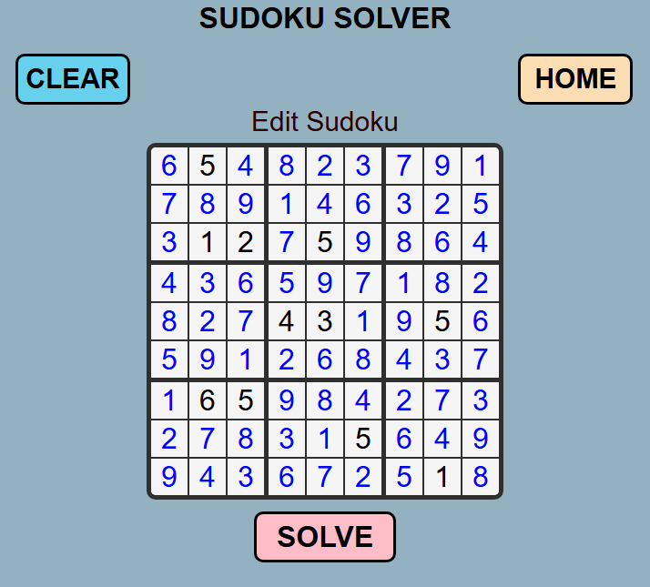

# Sudoku Solver

A Sudoku solver built with vanilla JavaScript, CSS, and HTML.

 <!-- Replace with actual screenshot if available -->

## Features

- Interactive 9x9 Sudoku grid
- Input validation to ensure proper Sudoku rules
- Solve button to automatically fill in the solution
- Clear button to reset the board
- Responsive design that works on desktop and mobile
- Visual feedback for invalid inputs

## Implementation Details

### Technologies Used

- Vanilla JavaScript (no frameworks or libraries)
- Plain CSS for styling
- Semantic HTML5

One of my first hobby project using Vanilla Javascript - No Frameworks.
Sudoku Solver that solves almost all Sudoku problems.
Basic HTML, Vanilla CSS and Vanilla Javascript.
